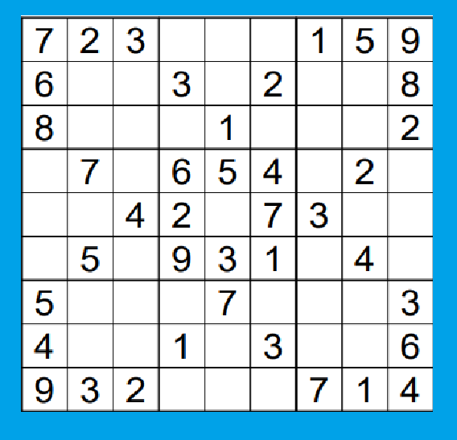
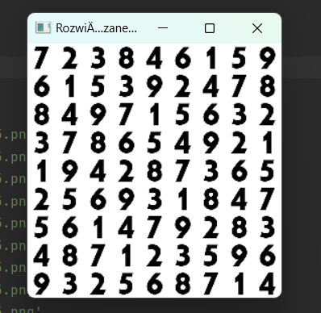

# sudoku
## 🚀 Introduction
In my project, I wanted to create a sudoku-solving program  
## 📷 Photo   
Sudoku we want to solve

Solved sudoku

## 🛠️ How it's working
1) main.py - CV2 detection of squares with numbers
2) roz_liczb.py - Prediction of a number from a photo in a square to a number in the code
3) rozpoznawanie.py - Test file to assess the quality of the prediction yourself
4) rozwiazanie_sudoku.py - Solving sudoku as a matrix
5) test.py - CNN model for number recognition
6) zdj_rozwiazania.py - The final file where we display the solved sudoku

## 💻 Code download
If you want to check the working of my code, you need to unpack Fnt in the photo directory
